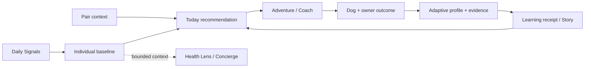

# Woof 🐾

**A relationship-first pet companion that helps people choose one useful thing to do with their dog, learn from how it went, and make the next shared moment easier.**

[](apps/web)
[](apps/api)
[](apps/mobile)
[](packages/database)
[](package.json)

Woof began as a pet socialization and compatibility project. The current codebase has evolved into a broader **dogOS** experiment: a hardware-agnostic longitudinal context layer for everyday dog life.

The product is deliberately not a diagnosis engine, an engagement-maximizing feed, or a universal pet score. Its central question is simpler:

> **What would be a good thing for this dog and person to do together right now, why, and what should Woof learn from the outcome?**

This repository is an active engineering and product research project. It contains production-oriented infrastructure and strongly qualified subsystems, but it should not be interpreted as a clinically validated veterinary product or a claim of broad public-production readiness.

---

## Product thesis

Woof is built around one relationship loop:

```text
notice -> choose -> do together -> read the response -> adapt -> remember -> make next time easier
```

A screen earns its place when it helps the owner:

- choose a useful shared action,
- notice what the dog is communicating,
- handle, reinforce, or pace an activity more clearly,
- adapt difficulty or context,
- preserve evidence that should improve a later decision.

The dog and human are both part of the system. Their outcomes can disagree, and Woof keeps those signals separate instead of collapsing them into one opaque score.



The guiding product principles live in [`docs/RELATIONSHIP_FIRST_PRODUCT_PRINCIPLES.md`](docs/RELATIONSHIP_FIRST_PRODUCT_PRINCIPLES.md).

---

## What is on `main` today

Woof uses explicit maturity boundaries. **Implemented** means the canonical path exists. **Qualified** means dedicated tests/CI enforce the stated contract. **Shadow** means a capability may produce evidence but has intentionally limited authority. **Planned** means the roadmap exists but the release is not complete.

| Capability | State | Current role |
| --- | --- | --- |
| First Adventure onboarding | Implemented + qualified | Creates the account/pet first, then asks only a few optional high-value personalization questions. Sparse profiles never block first use. |
| Today | Implemented + qualified | Action-first home surface with one primary shared recommendation and subordinate alternatives/supporting context. |
| Adventure | Implemented + qualified | Shared activities, outcomes, safe opt-outs, Bond XP, pathway context, and bounded recommendation adaptation. |
| Adaptive Profile | Implemented + qualified | Pair-scoped evidence with provenance, uncertainty, corrections, skip/not-sure semantics, and deterministic progressive-question policy. |
| Adventure learning v2 | Implemented + qualified | Learns bounded recommendation-fit signals from canonical outcomes while keeping reward authority and temporary owner load separate. |
| Daily Signals + individual baseline substrate | Implemented + qualified backend | Canonical private check-ins, evidence projection, and deterministic longitudinal baseline policy. The richer Today capture/correction UX remains roadmap work. |
| Coach | Implemented v1 | Reward-based practice flow. A deeper individualized skill graph and relationship-mastery model remain planned. |
| Health Lens | Implemented + safety hardened | Conservative photo/context screening and handoff support with deterministic emergency boundaries and explicit model provenance. Not a diagnostic product. |
| Behavior Vision | Shadow only | Derived behavior evidence with active-release attestation. It has zero Compatibility, safety, or canonical pet-state authority. |
| Compatibility + Discovery | Implemented | Social matching remains a supporting capability with deterministic fallback and tightly governed learned-model promotion. |
| Realtime messaging | Implemented + heavily qualified | Runtime payload validation, relationship authorization, bounded abuse control, finite session leases, persisted revocation, and private delivery rules. |
| Session authority | Implemented + qualified | Persisted server-owned login sessions support immediate logout/logout-all revocation across protected HTTP and new realtime work. |
| Deployment | Configured + qualified structurally | Fly API and Vercel Web workflows use explicit health/readiness gates. External deployment credentials remain environment-owned configuration. |

The project intentionally resists making every experimental model authoritative simply because it can produce a score.

---

## The authority model

A recurring design rule in Woof is that **different facts have different owners**.

### Recommendation authority is not reward authority

Bond XP is a game mechanic. It is not a recommendation label.

Adventure learning distinguishes:

- what activity/pathway Woof recommended,
- where the reward policy placed XP,
- how the dog appeared to experience the activity,
- how burdensome the activity felt to the human,
- whether stopping was the correct welfare-respecting choice.

A dog loving an activity while the owner says it was a lot today can therefore produce two simultaneous truths: durable positive dog-fit evidence and temporary lower-effort context.

See [`docs/DOGOS_ADVENTURE_LEARNING_V2.md`](docs/DOGOS_ADVENTURE_LEARNING_V2.md).

### Model output is not release authority

Learned systems follow an `off -> shadow -> promoted` ladder with deterministic fallback. Promotion is tied to versioned evidence and exact release identity rather than a model declaring itself trustworthy.

Compatibility promotion includes leakage-resistant evaluation, calibration/safety gates, cluster-aware uncertainty, artifact identity, and signed promotion receipts. Behavior Vision independently verifies the release the worker is actually serving before its evidence can contribute to current longitudinal learning.

### Baseline context is not medical authority

Woof can learn an individual dog's recent pattern without turning that pattern into a disease probability or universal wellness score. Missing evidence remains missing; stale evidence remains stale; disagreement reduces authority.

Health Lens retains its own deterministic emergency boundary and cannot be made less urgent by a model or baseline summary.

---

## First Adventure

The canonical onboarding path is intentionally small:

1. create the human account,
2. create the authorized pet/household pair,
3. optionally answer a few questions that can materially improve the first recommendation,
4. enter the real Today/Adventure loop.

Account and pet creation have separate replay identities so uncertain/lost HTTP responses can be retried without silently creating duplicates. Browser recovery state is only a hint; the server re-authorizes the pair before resuming.

See [`docs/FIRST_ADVENTURE_RELEASE.md`](docs/FIRST_ADVENTURE_RELEASE.md).

---

## Today and Adventure

Today is designed around one decision rather than a dashboard wall:

- **What should we do?**
- **Why does it fit now?**
- **How should I approach it?**
- **What happened afterward?**

Alternatives remain available but visually subordinate. Concierge and game progress support the recommendation rather than competing for top-level attention.

Adventure outcomes distinguish dog experience, owner experience, and safe opt-outs. Temporary hard days can make future suggestions gentler without being converted into permanent dog traits.

---

## Longitudinal intelligence

The dogOS intelligence layer separates canonical occurrence truth from a derived read model.

Current foundations include:

- private Daily Signals check-ins,
- household/timezone-aware local-day identity,
- replay-safe evidence projection,
- explicit evidence provenance,
- correction/supersession semantics,
- deterministic per-dimension baseline policy,
- sparse / learning / established / stale states,
- bounded recent and baseline windows,
- explicit uncertainty and source disagreement.

The next user-facing work is not “invent a smarter health score.” It is to make these foundations useful through calm capture, correction, explanation, and bounded cross-product context.

Relevant contracts:

- [`docs/DOGOS_INTELLIGENCE_BASELINE_POLICY_V1.md`](docs/DOGOS_INTELLIGENCE_BASELINE_POLICY_V1.md)
- [`docs/DOGOS_INTELLIGENCE_EVIDENCE_PROJECTION_V1.md`](docs/DOGOS_INTELLIGENCE_EVIDENCE_PROJECTION_V1.md)
- [`docs/DOGOS_INTELLIGENCE_DAILY_SIGNALS_CAPTURE_V1.md`](docs/DOGOS_INTELLIGENCE_DAILY_SIGNALS_CAPTURE_V1.md)

---

## Health Lens

Health Lens is a privacy-conscious screening/documentation surface, not automated veterinary diagnosis.

Its architecture keeps several boundaries explicit:

- deterministic emergency/red-flag screening runs before model analysis,
- model output can escalate but cannot downgrade emergency authority,
- unsafe treatment directives are rejected server-side,
- raw image bytes are transient rather than stored in the ordinary social-media path,
- derived assessments carry model/provider/policy provenance when a model was used,
- model-unavailable paths fail conservatively rather than fabricating image findings.

The long-term goal is better observation and professional handoff, not replacing veterinary care.

---

## Behavior Vision

Behavior Vision is deliberately **shadow evidence**.

The specialized worker and API must agree on the exact active release identity before observations can contribute to the current profile. Older qualified releases remain auditable history but no longer influence active longitudinal learning after a new release becomes authoritative.

Behavior Vision cannot currently:

- drive Compatibility,
- mutate canonical pet state,
- make safety decisions,
- self-promote,
- convert social orientation into a dog-to-dog greeting claim.

This is intentional. The system is designed so a promising model can be useful before it is trusted with product authority.

---

## Social compatibility is now a supporting loop

Woof still contains the social graph, compatibility, discovery, conversation, meetup, and outcome ideas that the project started with.

The difference is hierarchy. Finding another dog is one possible shared-life capability, not the product's entire identity.

Compatibility remains interesting because real-world outcomes can become relationship evidence. But the product should still be useful on a day when the owner has no interest in finding a new dog friend.

---

## Repository architecture

```text
woof/
├── apps/
│   ├── api/             # NestJS API, domain services, realtime, dogOS policies
│   ├── web/             # Next.js web/PWA product
│   └── mobile/          # Expo / React Native client
├── packages/
│   ├── database/        # Prisma + PostgreSQL/pgvector
│   ├── ui/              # shared UI primitives
│   └── config/          # shared TypeScript/ESLint configuration
├── ml/                  # model training/evaluation + specialized workers
├── docs/                # executable architecture/product/release contracts
├── infra/               # infrastructure configuration
├── n8n/                 # automation workflows
└── legacy/              # preserved early prototypes, not canonical runtime
```

At runtime, PostgreSQL remains the source of transactional/authorization truth. Derived intelligence projections and learned-model outputs do not replace canonical state ownership.

---

## Engineering posture

This repository has become intentionally strict about the difference between **a feature existing** and **a feature earning authority**.

Current quality practices include:

- committed `pnpm-lock.yaml`,
- frozen-lockfile CI installs,
- zero-warning lint lanes,
- whole-monorepo TypeScript checks,
- unit and PostgreSQL integration contracts,
- Playwright browser/accessibility/visual contracts,
- production API and Web builds,
- production Docker boot/HTTP/Socket.IO proofs on high-risk backend surfaces,
- immutable/pinned critical CI action contracts,
- explicit policy/release receipts for sensitive deterministic and learned systems.

A green generic build is not treated as sufficient evidence for a security, ML, health, or concurrency release. Those areas have dedicated qualification lanes that encode their specific authority boundaries.

---

## Running locally

### Prerequisites

- Node.js 20+
- pnpm 8.15.1+
- Docker / Docker Compose
- Python only for ML/specialized-worker development

### Install

```bash
pnpm install --frozen-lockfile
```

### Start local dependencies and applications

```bash
docker compose up -d

cp apps/api/.env.example apps/api/.env
cp apps/web/.env.local.example apps/web/.env.local

pnpm --filter @woof/database db:generate
pnpm --filter @woof/database db:migrate
pnpm --filter @woof/api db:seed

pnpm --filter @woof/api dev
pnpm --filter @woof/web dev
```

Typical local endpoints:

| Surface | URL |
| --- | --- |
| Web | `http://localhost:3000` |
| API | `http://localhost:4000` |
| Swagger | `http://localhost:4000/docs` |
| Optional ML service | `http://localhost:8001` |

### Repository verification

```bash
pnpm format:check
pnpm lint
pnpm type-check
pnpm test
pnpm build
```

Or run the aggregate contract:

```bash
pnpm verify
```

---

## Deployment

The repository contains separate staging and production workflows for:

- Fly.io API deployment,
- API liveness/readiness verification,
- Vercel Web build/deployment.

Deployment credentials are external authority, not repository defaults. A deploy environment must provide the required Fly/Vercel secrets; the workflows should fail clearly rather than inventing interactive/fallback identities.

See [`DEPLOYMENT_GUIDE.md`](DEPLOYMENT_GUIDE.md) and [`docs/CI_ACTION_RUNTIME.md`](docs/CI_ACTION_RUNTIME.md).

---

## What should be built next

The codebase no longer needs more feature count for its own sake. The highest-leverage work is to connect the strong backend contracts into a small number of visible, measurable product loops.

### 1. Counterfactual Adventure decision/outcome ledger

Persist the candidate set, eligibility, ranking policy/version, reason codes, eventual choice, and outcome for every recommendation decision. This is the prerequisite for honest offline replay, future propensity logging, and learned personalization that can be evaluated rather than merely trained.

Roadmap: [#43](https://github.com/sidhulyalkar/woof/issues/43)

### 2. Coach skill graph + relationship mastery

Turn Coach from a useful v1 lesson flow into an individualized curriculum that separately tracks dog skill/comfort, owner handling fluency, pair communication/recovery, and context generalization.

Roadmap: [#44](https://github.com/sidhulyalkar/woof/issues/44)

### 3. Make longitudinal intelligence visible

Finish the calm Daily Signals / correction / explanation loop and feed only bounded, uncertainty-preserving context into downstream surfaces.

Roadmaps: [#34](https://github.com/sidhulyalkar/woof/issues/34), [#35](https://github.com/sidhulyalkar/woof/issues/35)

### 4. Make game progression mean something

Build chapters, discoveries, mastery, and memory around real shared experiences rather than adding more point counters or streak pressure.

Roadmap: [#45](https://github.com/sidhulyalkar/woof/issues/45)

### 5. Earn learned ranking with data

Only after the decision/outcome substrate exists should the personalized ranker/contextual-bandit program move beyond shadow/offline evaluation.

Roadmap: [#46](https://github.com/sidhulyalkar/woof/issues/46)

### 6. Pilot the loop

The biggest remaining evidence gap is human, not architectural. A small owner pilot with trainer/veterinary feedback should measure time-to-first-useful-action, recommendation usefulness, correction rate, safe declines, owner burden, and whether professional handoff context is actually helpful.

Retention is useful as an outcome, not the optimization target.

---

## Design principles worth preserving

1. **Individual normal beats universal score.**
2. **Dog outcome and human outcome are separate signals.**
3. **A safe stop can be a successful decision.**
4. **Missing evidence is not reassurance.**
5. **Reward mechanics are not ML labels.**
6. **Models earn authority through evidence and exact release identity.**
7. **The owner should spend more attention on the dog than on Woof.**
8. **One useful next action beats a wall of clever features.**
9. **Professional handoff is a product success, not a failure of automation.**
10. **More complexity must beat a simpler baseline before it earns promotion.**

---

## Canonical documentation

The repository contains many release-specific contracts because high-risk features are expected to explain what they own and what they explicitly do not own.

Start with:

- [`docs/RELATIONSHIP_FIRST_PRODUCT_PRINCIPLES.md`](docs/RELATIONSHIP_FIRST_PRODUCT_PRINCIPLES.md)
- [`docs/FIRST_ADVENTURE_RELEASE.md`](docs/FIRST_ADVENTURE_RELEASE.md)
- [`docs/DOGOS_ADVENTURE_LEARNING_V2.md`](docs/DOGOS_ADVENTURE_LEARNING_V2.md)
- [`docs/DOGOS_SESSION_AUTHORITY.md`](docs/DOGOS_SESSION_AUTHORITY.md)
- [`docs/DOGOS_INTELLIGENCE_BASELINE_POLICY_V1.md`](docs/DOGOS_INTELLIGENCE_BASELINE_POLICY_V1.md)
- [`docs/DOGOS_BEHAVIOR_VISION_RELEASE_AUTHORITY.md`](docs/DOGOS_BEHAVIOR_VISION_RELEASE_AUTHORITY.md)
- [`docs/HEALTH_LENS.md`](docs/HEALTH_LENS.md)
- [`docs/CI_ACTION_RUNTIME.md`](docs/CI_ACTION_RUNTIME.md)
- [Integrated dogOS roadmap #30](https://github.com/sidhulyalkar/woof/issues/30)
- [Adaptive Adventure roadmap #41](https://github.com/sidhulyalkar/woof/issues/41)

Historical reports and prototypes remain useful context, but they should not be read as the current product contract.

---

## Why this project is interesting

Woof looks friendly on the surface, but the hard problem underneath is authority.

Who owns the truth when:

- a model disagrees with a deterministic safety screen,
- the dog enjoys an activity but the human finds it exhausting,
- XP rewards a welfare-respecting stop,
- a browser retries a request after the server may already have committed it,
- a realtime token is valid cryptographically but its server session has been revoked,
- a new model version starts serving after months of older longitudinal evidence,
- an owner corrects something the system previously inferred?

The codebase is increasingly organized around making those answers explicit, testable, and reversible.

The next challenge is equally important: making all that machinery disappear into a product that feels simple enough to use while standing next to your dog.

---

## License

MIT
