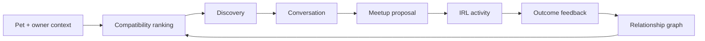
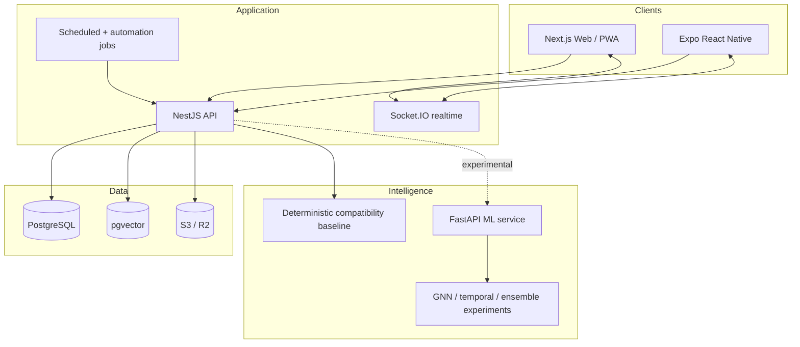

# Woof 🐾

### A full-stack pet social coordination system for turning online compatibility into safer, repeatable real-world dog friendships.

[](apps/web)
[](apps/api)
[](apps/mobile)
[](packages/database)
[](package.json)

> **Portfolio case study.** Woof is intentionally broader than a CRUD social app. It explores product design, social graph modeling, geospatial coordination, trust and safety, activity telemetry, realtime systems, experimentation, and ML-assisted matching in one coherent product surface.

## The product thesis

Dog owners do not really need another feed. They need help answering a harder question:

**Who nearby is a genuinely good fit for my dog, when should we meet, where should we go, and did the match actually work in the real world?**

Woof is designed around that loop:



The interesting engineering problem is not recommendation in isolation. It is building a system that can **learn from real-world social outcomes while remaining useful before the ML is perfect**.

---

## What this project demonstrates

Woof is a monorepo containing a web product, native mobile client, API, relational and graph-oriented data model, realtime messaging, automation workflows, observability hooks, and an experimental ML service.

| Area | What is implemented | Why it matters |
| --- | --- | --- |
| Product UX | Feed, discovery, pet profiles, events, activity tracking, messaging, services, gamification | Demonstrates a complete multi-surface consumer product rather than isolated screens |
| Web | Next.js App Router, React Query, Zustand, Tailwind, Radix primitives, PWA support | Modern server/client architecture with reusable accessible UI |
| Mobile | Expo / React Native client with native navigation, location, maps, camera and notifications | Shows platform-aware product thinking beyond responsive web |
| Backend | NestJS modular API, JWT auth, Socket.IO, validation, rate limiting, storage integrations | Separates domain concerns and supports synchronous and realtime workloads |
| Data | PostgreSQL + Prisma + pgvector, pet relationship edges, activities, events, feedback and goals | Models transactional state plus future learning signals |
| Matching | Deterministic compatibility baseline plus an experimental Python ML service | Core behavior stays stable during cold start or model-service failure |
| Experimentation | A/B testing and outcome-oriented analytics concepts | Ranking changes can be judged on behavior rather than offline metrics alone |
| Operations | Docker, CI, Sentry hooks and deployment configuration | Treats reliability and deployment as product concerns |

### Maturity labels

To keep the project technically honest, I use explicit maturity language:

- **Implemented**: code is present in the canonical product path.
- **Integrated**: multiple subsystems are connected through that path.
- **Experimental**: research/prototype code exists but should not be interpreted as production evidence.
- **Planned**: architectural direction only.

The GNN, temporal, similarity and ensemble work under [`ml/`](ml/) is intentionally presented as **experimental ML research** until it clears the same integration, calibration and outcome gates as the deterministic baseline.

---

## Product experience

### 1. Discover compatible dogs, not just nearby users

A match is modeled as a relationship between pets, with owner context layered around it. The current baseline can use persisted profile attributes and exposes **score provenance, confidence, factor breakdown and human-readable reasons** instead of an unexplained percentage.

### 2. Move from recommendation to coordination

Discovery connects to conversation, events and meetup proposals. The product is designed to reduce the gap between “this looks promising” and “we actually met at the park.”

### 3. Capture the signal most social products throw away

The strongest compatibility label is not a swipe. It is what happened after the dogs met:

- Did both owners attend?
- Did the dogs play successfully?
- Was a slow introduction needed?
- Did the pair meet again?
- Did either owner mark the relationship as avoid?
- Did the meetup lead to more joint activity?

Those outcomes can become relationship edges, ranking labels and trust signals.

### 4. Build habits around shared activity

Walks, runs, hikes, play sessions, goals, streaks and events make Woof useful even when a user is not actively searching for a new friend. This creates a healthier retention loop than endless feed consumption.

---

## Frontend and design system

The web experience is designed as a **mobile-first companion product** with a desktop-capable shell rather than a pile of unrelated demo pages.

Portfolio hardening focused the visual system around a calm deep-neutral foundation, warm amber action color, teal compatibility/success signal, stronger information hierarchy, and fewer competing navigation destinations.

Design principles:

1. **Calm over noisy.** Social, location and compatibility information is already dense; the interface should reduce visual competition.
2. **Explain the recommendation.** Compatibility surfaces reasons, confidence and uncertainty where possible.
3. **Action near context.** Message, meetup and activity actions sit close to the pet or event that motivated them.
4. **Accessible by default.** Visible focus, semantic controls, minimum touch targets, skip navigation and reduced-motion behavior are requirements.
5. **One product identity.** Earlier code mixed “PetPath” and “Woof”; the canonical application now standardizes on **Woof**.
6. **Useful failure states.** Feed and recommendation failures degrade locally instead of turning the entire product into a dead end.
7. **Mobile navigation is scarce real estate.** The primary bar is intentionally reduced to Home, Discover, Create, Inbox and Profile; secondary destinations stay contextual.

The home experience now begins with user intent: **find a match, plan a meetup, log activity, or review progress**. The feed becomes one useful surface rather than the whole product.

---

## Architecture



### Canonical repository map

```text
woof/
├── apps/
│   ├── web/             # Next.js 15 web/PWA client
│   ├── mobile/          # Expo React Native client
│   └── api/             # NestJS application API
├── packages/
│   ├── database/        # Prisma schema + PostgreSQL/pgvector access
│   ├── ui/              # Shared UI primitives
│   └── config/          # Shared tooling configuration
├── ml/                  # Experimental training + FastAPI inference work
├── n8n/                 # Automation workflows
├── infra/               # Deployment/infrastructure configuration
├── docs/                # Canonical architecture, product and ML documentation
└── legacy/              # Preserved pre-monorepo prototypes, not active entry points
```

Historical milestone reports are preserved under [`docs/archive/`](docs/archive/) rather than competing with the current project entry point.

For the deeper walkthrough, see [`docs/ARCHITECTURE.md`](docs/ARCHITECTURE.md).

---

## Matching architecture: useful before “AI”, extensible after it

A portfolio-quality ML product should not require a model server just to behave coherently.

### Layer 0: deterministic product baseline

The canonical API now computes a repeatable compatibility estimate instead of the historical random placeholder. The baseline:

- rejects self-matches,
- uses only available persisted pet signals,
- weights breed lightly rather than treating it as destiny,
- recalculates legacy edge recommendations deterministically,
- returns `source`, `confidence`, `factors`, and `explanation`,
- provides a stable control for future model evaluation.

This matters for debugging, regression testing, cold start, graceful degradation and honest ML comparison.

### Layer 1: learned representations

The database includes vector support so learned representations can be attached to pet/product entities without replacing transactional state.

### Layer 2: experimental graph and temporal models

The [`ml/`](ml/) package explores graph attention, graph similarity, temporal modeling, diffusion and ensembles. These are research artifacts until they clear an explicit promotion gate.

### Layer 3: outcome calibration

The real objective is not “high offline similarity.” It is better real-world outcomes: accepted matches, completed meetups, positive post-meetup feedback, repeat interactions and safe long-term graph formation.

See [`docs/ML_SYSTEM.md`](docs/ML_SYSTEM.md) for evidence levels E0 through E5, split strategy, metrics, serving requirements and promotion gates.

---

## Data model and learning flywheel

The schema stores both **entities** and **relationships**.

Core entities include users, pets, activities, meetups, events, services, posts and conversations. `PetEdge` represents the evolving relationship between two pets and can carry compatibility, interaction and status information.

```text
profile features
    ↓
candidate generation
    ↓
compatibility ranking
    ↓
message / meetup
    ↓
attendance + activity + feedback
    ↓
relationship edge update
    ↓
future ranking / experimentation
```

The central idea is that **the product itself becomes an instrumentation system for better future matching**.

---

## Full-scale engineering considerations

The codebase is intentionally designed around the questions a real local social network eventually faces.

### Geospatial scale

Nearby discovery should eventually use indexed geospatial search, constrained candidate generation, locality-aware caches and deliberately reduced public location precision.

### Social graph scale

Relationship edges grow much faster than users. The system should never materialize every possible pet pair. Confirmed/observed edges plus approximate candidate generation are more tractable.

### Realtime messaging

Socket connections are stateful. A scaled topology needs shared pub/sub, reconnect catch-up, authorization on room joins, idempotent persistence and backpressure-aware fanout.

### ML serving

Inference is separated from the main API so model dependencies can evolve independently. Production promotion should require latency, calibration, fallback behavior and measured outcome lift, not an impressive model class name.

### Trust and safety

Pet meetups involve real people and locations. A serious deployment needs blocking/reporting, verification policy, moderation queues, rate controls, suspicious-account signals, location-sharing boundaries and safety guidance.

### Privacy

Home coordinates, routes and schedules are unusually sensitive. Precise private location, coarse discovery location and public meetup location should be distinct data products with different retention and permission rules.

### Observability

Reliability telemetry, product analytics and model telemetry should remain separate. Important measures include request latency, realtime health, push failure, model fallback rate, ranking latency, meetup funnel conversion, calibration and safety events.

### Reliability

Subsystem failure should remain local: ML failure falls back to deterministic scoring; push failure should not invalidate a meetup; media failure should not corrupt relational state; realtime failure should not erase message history.

### Experimentation

A ranking change is successful only if it improves downstream behavior without damaging safety, calibration, diversity or fairness. Click lift alone is not enough.

---

## Security posture

Implemented foundations include JWT authentication, request validation, Helmet, origin controls, rate limiting, upload constraints and monitoring hooks.

Before treating Woof as an internet-facing production service, I would still require:

- threat modeling for location and meetup flows,
- secrets rotation and environment validation,
- dependency and container scanning,
- explicit authorization tests for every user-owned resource,
- abuse/reporting workflows,
- backup and restore drills,
- audit logging for sensitive actions,
- privacy/export/deletion workflows,
- deployed security-header verification.

See [`SECURITY.md`](SECURITY.md). This README deliberately avoids calling the repository “production ready” simply because production-oriented components exist.

---

## Engineering quality

The repository now has explicit local and CI gates for formatting, linting, TypeScript checking, unit tests, browser smoke tests and production builds.

A known reproducibility gap remains: **there is not yet a committed `pnpm-lock.yaml`**. CI therefore installs with `--no-frozen-lockfile` rather than pretending a lockfile exists. Adding and validating the lockfile is a prerequisite before claiming reproducible builds.

Browser authentication smoke tests mock the invalid-login network response so they do not secretly depend on a live API. The seeded full-stack login remains an explicit integration test.

```bash
pnpm format:check
pnpm lint
pnpm type-check
pnpm test
pnpm build
```

Contributor conventions live in [`CONTRIBUTING.md`](CONTRIBUTING.md).

---

## Running locally

### Prerequisites

- Node.js 20+
- pnpm 8.15+
- Docker / Docker Compose
- Python only if running the experimental ML service

### Start the core product

```bash
pnpm install

docker compose up -d

cp apps/api/.env.example apps/api/.env
cp apps/web/.env.local.example apps/web/.env.local

pnpm --filter @woof/database db:generate
pnpm --filter @woof/database db:migrate
pnpm --filter @woof/api db:seed

pnpm --filter @woof/api dev
pnpm --filter @woof/web dev
```

Default local endpoints:

| Surface | URL |
| --- | --- |
| Web | `http://localhost:3000` |
| API | `http://localhost:4000` |
| Swagger | `http://localhost:4000/docs` |
| ML service, optional | `http://localhost:8001` |

---

## Canonical documentation

- [`docs/ARCHITECTURE.md`](docs/ARCHITECTURE.md) — system boundaries, data flow, failure modes and scale
- [`docs/PRODUCT_CASE_STUDY.md`](docs/PRODUCT_CASE_STUDY.md) — product strategy, UX decisions and metrics
- [`docs/ML_SYSTEM.md`](docs/ML_SYSTEM.md) — baseline, experimental models, evidence levels and promotion gates
- [`docs/api-spec.md`](docs/api-spec.md) — API reference
- [`docs/data-models.md`](docs/data-models.md) — data model overview
- [`DEPLOYMENT_GUIDE.md`](DEPLOYMENT_GUIDE.md) — deployment notes
- [`docs/archive/`](docs/archive/) — historical development reports, preserved but non-canonical
- [`legacy/`](legacy/) — early mock prototypes, preserved but non-canonical

---

## What I would build next

The next phase is intentionally about **validation and integration**, not feature count:

1. Generate, commit and validate a reproducible pnpm lockfile.
2. Run the repaired CI workflow on the full change set and fix any latent failures it exposes.
3. Connect the advanced ML service to the same compatibility response contract as the deterministic baseline.
4. Build leakage-resistant evaluation datasets from seeded and eventually real post-meetup outcomes.
5. Add model fallback telemetry, score provenance persistence and calibration dashboards.
6. Add precise trust/safety and privacy controls around location and IRL coordination.
7. Add automated accessibility and visual-regression checks to the frontend pipeline.
8. Deploy a public synthetic-data demo with no sensitive location flows.
9. Measure discovery → conversation → meetup → repeat-meetup conversion rather than optimizing feed engagement alone.

---

## Why Woof belongs in my portfolio

Woof is less interesting as “a social app for dog owners” than as a systems problem disguised as a friendly consumer product.

It forced decisions across:

- interaction and visual design,
- mobile/web product architecture,
- API contracts,
- relational and graph-like data modeling,
- realtime systems,
- geospatial privacy,
- deterministic baselines and research ML,
- experimentation,
- trust and safety,
- observability,
- graceful degradation,
- CI and deployment,
- scale planning.

The result demonstrates how I approach a product from **user experience through infrastructure and learning systems**, while being explicit about what is implemented, what is integrated, what is experimental, and what evidence is still required.

---

## License

MIT © Sidharth Hulyalkar
