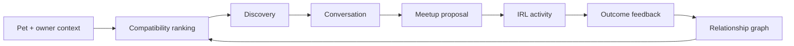
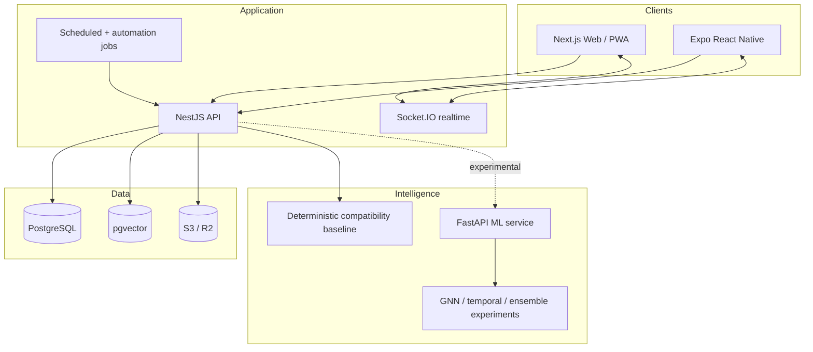

# Woof 🐾

### A full-stack pet social coordination system for turning online compatibility into safer, repeatable real-world dog friendships.

[](apps/web)
[](apps/api)
[](apps/mobile)
[](packages/database)
[](package.json)

> **Portfolio case study.** Woof is intentionally broader than a CRUD social app. It explores product design, social graph modeling, geospatial coordination, trust and safety, activity telemetry, real-time systems, experimentation, and ML-assisted matching in one coherent product surface.

## The product thesis

Dog owners do not really need another feed. They need help answering a much harder question:

**Who nearby is a genuinely good fit for my dog, when should we meet, where should we go, and did the match actually work in the real world?**

Woof is designed around that loop:



The interesting engineering problem is not recommendation in isolation. It is building a system that can **learn from real-world social outcomes while remaining useful before the ML is perfect**.

---

## What this project demonstrates

Woof is a monorepo containing a web product, native mobile client, API, relational/graph-oriented data model, real-time messaging, automation workflows, observability hooks, and an experimental ML service.

| Area | What is implemented | Why it matters |
| --- | --- | --- |
| Product UX | Feed, discovery, pet profiles, events, activity tracking, messaging, services, gamification | Demonstrates a complete multi-surface consumer product rather than isolated screens |
| Web | Next.js App Router, React Query, Zustand, Tailwind, Radix primitives, PWA support | Modern server/client application architecture with accessible reusable UI |
| Mobile | Expo / React Native client with native navigation, location, maps, camera and notifications | Shows platform-aware product thinking beyond responsive web |
| Backend | NestJS modular API, JWT auth, Socket.IO, validation, rate limiting, storage integrations | Separates domain concerns and supports both synchronous and real-time workloads |
| Data | PostgreSQL + Prisma + pgvector, pet relationship edges, activities, events, feedback and goals | Models both transactional product state and learning signals |
| Matching | Deterministic compatibility fallback plus an experimental Python ML service | Product remains stable when the model service is unavailable; ML can evolve independently |
| Experimentation | A/B testing and outcome-oriented analytics concepts | Enables model and product changes to be judged on behavior, not only offline metrics |
| Operations | Docker, CI workflows, Sentry hooks, Vercel/Fly deployment configuration | Treats observability and deployment as first-class system concerns |

### Maturity labels used in this repository

To keep the project technically honest, features are described with explicit maturity:

- **Implemented**: code is present in the primary product path.
- **Integrated**: two or more subsystems are connected through the application path.
- **Experimental**: research/prototype code exists but should not be interpreted as production evidence.
- **Planned**: architectural direction only.

The advanced GNN / temporal / ensemble work under [`ml/`](ml/) is intentionally presented as **experimental ML research** until it is validated end-to-end against the live compatibility path and real outcome data.

---

## Product experience

### 1. Discover compatible dogs, not just nearby users

A match is modeled as a relationship between pets, with owner context layered around it. The product can reason about temperament, species, activity patterns, distance, availability, previous interactions and eventually learned embeddings.

The key UX goal is **explainable confidence**. A useful recommendation should tell the owner why a match surfaced rather than exposing an unexplained score.

### 2. Move quickly from recommendation to coordination

Discovery connects directly to conversation, events and meetup proposals. The product is designed to reduce the awkward gap between “this looks promising” and “we actually met at the park.”

### 3. Capture the signal that most social products throw away

The strongest compatibility label is not a swipe. It is what happened after the dogs met:

- Did both owners attend?
- Did the dogs play successfully?
- Was a slow introduction needed?
- Did the pair meet again?
- Did either owner mark the relationship as avoid?
- Did the meetup lead to more joint activity?

Those outcomes can become graph edges, ranking labels and trust signals.

### 4. Build habits around shared activity

Walks, runs, hikes, play sessions, goals, streaks and events make Woof useful even when a user is not actively searching for a new friend. This creates a healthier retention loop than endless feed consumption.

---

## Frontend and design system

The web experience is designed as a **mobile-first companion product** with a desktop-capable shell rather than a collection of unrelated demo pages.

Design principles:

1. **Calm over noisy.** Social information, location and compatibility are already cognitively dense; the UI should reduce visual competition.
2. **Explain the recommendation.** Compatibility should expose reasons, confidence and uncertainty where possible.
3. **Action near context.** Message, meetup and activity actions should sit close to the pet or event that motivated them.
4. **Accessible by default.** Keyboard focus, minimum touch targets, semantic controls and reduced-motion support are design requirements.
5. **One product identity.** The codebase historically mixed “PetPath” and “Woof”; the current portfolio direction standardizes on **Woof**.
6. **Useful empty/error states.** Network and model services can fail independently, so product surfaces must degrade gracefully.

The visual language uses warm canine/product cues over a deep neutral foundation, reserving bright color for status, compatibility and primary actions instead of turning every surface into neon chrome.

---

## Architecture



### Monorepo map

```text
woof/
├── apps/
│   ├── web/             # Next.js 15 web/PWA client
│   ├── mobile/          # Expo React Native client
│   └── api/             # NestJS application API
├── packages/
│   ├── database/        # Prisma schema and PostgreSQL/pgvector access
│   ├── ui/              # Shared UI primitives
│   └── config/          # Shared TypeScript / tooling configuration
├── ml/                  # Experimental model training + FastAPI inference service
├── n8n/                 # Automation workflows
├── infra/               # Deployment/infrastructure configuration
└── docs/                # Canonical technical and product documentation
```

For the deeper system walkthrough, see [`docs/ARCHITECTURE.md`](docs/ARCHITECTURE.md).

---

## Matching architecture: useful before “AI”, extensible after it

A portfolio-quality ML product should not require a model server just to behave coherently.

Woof therefore separates matching into layers:

### Layer 0: deterministic product baseline

The primary application path can produce repeatable compatibility behavior from persisted pet attributes. This is important for:

- debugging,
- regression testing,
- cold start,
- model outages,
- explainability,
- measuring whether ML beats a sensible baseline.

### Layer 1: learned feature representations

The database schema includes vector support so learned representations can be attached to pet/product entities without replacing transactional data.

### Layer 2: experimental graph and temporal models

The [`ml/`](ml/) package explores graph attention, graph similarity, temporal modeling and ensemble approaches. These models are research artifacts until they clear an integration and evaluation gate.

### Layer 3: outcome calibration

The real objective is not “high offline similarity.” It is better real-world outcomes: accepted matches, completed meetups, positive post-meetup feedback, repeat interactions and safe long-term graph formation.

See [`docs/ML_SYSTEM.md`](docs/ML_SYSTEM.md) for the evidence model and promotion criteria.

---

## Data model and learning flywheel

The schema intentionally stores both **entities** and **relationships**.

Core entities include users, pets, activities, meetups, events, services, posts and conversations. `PetEdge` represents the evolving relationship between two pets and can carry compatibility, interaction and status information.

That enables a richer loop than a flat recommendation table:

```text
profile features
    ↓
candidate generation
    ↓
compatibility ranking
    ↓
message / meetup
    ↓
attendance + activity + feedback
    ↓
relationship edge update
    ↓
future ranking / experimentation
```

This is one of the central ideas behind the project: **the product itself is an instrumentation system for better future matching**.

---

## Full-scale engineering considerations

The codebase was designed with the questions a real consumer network would eventually face.

### Geospatial scale

At larger scale, nearby discovery should move from naive distance filtering to indexed geospatial queries, candidate precomputation and locality-aware caches. Location precision should be deliberately reduced on public surfaces.

### Social graph scale

Relationship edges grow faster than users. Candidate generation, graph traversal and recommendation writes should therefore avoid materializing all possible pet pairs. Confirmed/observed edges and approximate nearest-neighbor candidates are much more tractable.

### Realtime messaging

Socket connections are stateful. A production topology needs shared pub/sub, connection affinity or a managed realtime layer, idempotent message persistence and backpressure-aware fanout.

### ML serving

Model inference is isolated behind a service boundary so model dependencies do not pollute the main API runtime. Production promotion should require latency, calibration, fallback behavior and outcome lift, not simply an offline benchmark win.

### Trust and safety

Pet meetups involve real people and real locations. A serious version of Woof needs blocking/reporting, verification policy, location fuzzing, moderation queues, rate controls, suspicious-account signals, age requirements and clear emergency boundaries.

### Privacy

Home coordinates, routes and schedules are unusually sensitive. The architecture should minimize retention, separate precise/private location from public display, support deletion/export workflows and make location sharing explicitly contextual.

### Observability

Useful production telemetry includes request latency, realtime connection health, failed notification delivery, model fallback rate, ranking latency, meetup funnel conversion and safety events. Product analytics should be distinct from error monitoring.

### Reliability

The system is intentionally decomposable: feed failure should not prevent profile access; ML failure should fall back to deterministic scoring; notification failure should not invalidate meetup creation; object storage failure should not corrupt relational state.

### Experimentation

A recommendation change is only successful if it improves downstream behavior without damaging safety, calibration or fairness. The project includes experimentation concepts so ranking changes can be measured at the funnel and outcome level.

---

## Security posture

Implemented foundations include JWT authentication, request validation, Helmet, origin controls, rate limiting, upload constraints and error monitoring hooks.

Before treating Woof as an internet-facing production service, I would additionally require:

- threat modeling for location and meetup flows,
- secrets rotation and environment validation,
- dependency and container scanning,
- explicit authorization tests for every user-owned resource,
- abuse/reporting workflows,
- backup/restore drills,
- audit logging for sensitive actions,
- privacy/deletion workflows,
- security headers verified in the deployed environment.

This README deliberately avoids calling the current repository “production ready” simply because production-oriented components exist.

---

## Running locally

### Prerequisites

- Node.js 20+
- pnpm 8.15+
- Docker / Docker Compose
- PostgreSQL-compatible local environment via Compose
- Python only if running the experimental ML service

### Start the core product

```bash
pnpm install

docker compose up -d

cp apps/api/.env.example apps/api/.env
cp apps/web/.env.local.example apps/web/.env.local

pnpm --filter @woof/database db:generate
pnpm --filter @woof/database db:migrate
pnpm --filter @woof/api db:seed

pnpm --filter @woof/api dev
pnpm --filter @woof/web dev
```

Default local endpoints:

| Surface | URL |
| --- | --- |
| Web | `http://localhost:3000` |
| API | `http://localhost:4000` |
| Swagger | `http://localhost:4000/docs` |
| ML service, optional | `http://localhost:8001` |

### Quality gates

```bash
pnpm lint
pnpm type-check
pnpm test
pnpm build
pnpm format:check
```

---

## Canonical documentation

The root of this repository contains historical implementation reports from earlier development phases. They are useful provenance, but the following documents are the canonical portfolio-facing references:

- [`docs/ARCHITECTURE.md`](docs/ARCHITECTURE.md) — system boundaries, data flow, reliability and scale
- [`docs/PRODUCT_CASE_STUDY.md`](docs/PRODUCT_CASE_STUDY.md) — product decisions and portfolio narrative
- [`docs/ML_SYSTEM.md`](docs/ML_SYSTEM.md) — ML evidence levels, baseline, experimental models and promotion gates
- [`docs/api-spec.md`](docs/api-spec.md) — API reference
- [`docs/data-models.md`](docs/data-models.md) — data model overview
- [`DEPLOYMENT_GUIDE.md`](DEPLOYMENT_GUIDE.md) — deployment notes

---

## What I would build next

The next phase is intentionally about **validation and integration**, not adding more surface area:

1. Create a reproducible lockfile and make CI the source of truth for build/test status.
2. Connect the advanced ML service to the same compatibility contract as the deterministic baseline.
3. Build an evaluation dataset from seeded and eventually real post-meetup outcome labels.
4. Add model fallback telemetry and calibration dashboards.
5. Add precise trust/safety and privacy controls around location and IRL coordination.
6. Consolidate historical status documents into an archive.
7. Add visual regression and accessibility checks to the web pipeline.
8. Deploy a public read-only/demo environment with synthetic data and no sensitive location flows.

---

## Why Woof belongs in my portfolio

Woof is less interesting as “a social app for dog owners” than as a systems problem disguised as a friendly consumer product.

It forced decisions across:

- interaction and visual design,
- mobile/web product architecture,
- API boundaries,
- relational and graph-like data modeling,
- realtime systems,
- geospatial privacy,
- ML baselines and research models,
- experimentation,
- trust and safety,
- observability,
- graceful degradation,
- deployment and scale planning.

The result is a useful demonstration of how I approach a product from **user experience through infrastructure and learning systems**, while being explicit about which pieces are proven and which remain research.

---

## License

MIT © Sidharth Hulyalkar
