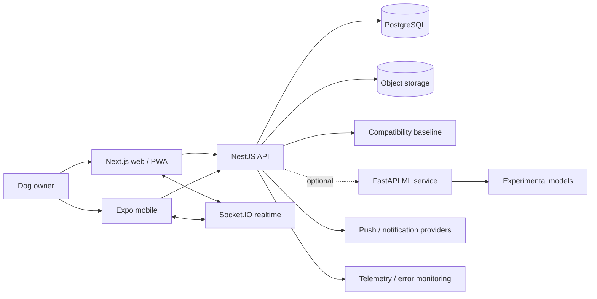
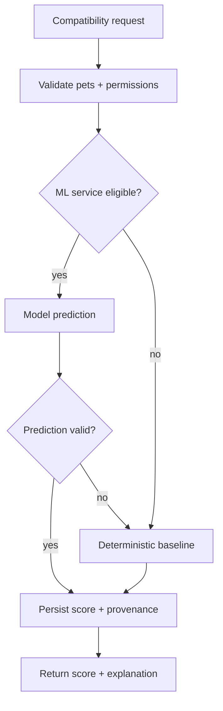

# Woof Architecture

This document is the canonical technical architecture for the Woof portfolio project. It focuses on system boundaries, failure modes, data flow and the decisions required to evolve the prototype into a reliable consumer platform.

## 1. Architectural goals

Woof optimizes for five properties:

1. **Product continuity**: core social and coordination flows should still work if optional services such as ML inference, notifications or object storage are degraded.
2. **Clear domain ownership**: users, pets, activities, conversations, meetups, events and compatibility remain explicit backend domains rather than leaking into a single service layer.
3. **Learning-ready instrumentation**: real product outcomes can become ranking labels without making the transactional database depend on a model runtime.
4. **Multi-client support**: web and native mobile clients share product semantics through one API contract.
5. **Progressive scale**: the local monorepo is simple to run, while boundaries map cleanly onto independently scaled production services later.

## 2. System context



## 3. Client architecture

### Web

The web application uses the Next.js App Router with React Query for server state and Zustand for lightweight session/client state. The UI is built from composable accessible primitives rather than page-specific styling islands.

Important boundaries:

- **server state** belongs in React Query,
- **session/local interaction state** belongs in Zustand or component state,
- **domain mutation** happens through typed API clients,
- **realtime events** should reconcile into query caches rather than create a parallel state universe.

The product is mobile-first, but desktop should provide additional information density rather than simply stretching the phone layout.

### Mobile

The Expo client shares API semantics but should not be a pixel-for-pixel port. Camera, notifications, location permissions, maps, safe-area behavior and platform navigation are native concerns.

## 4. API architecture

NestJS is organized around domain modules. The API owns:

- authorization,
- transactional writes,
- domain validation,
- canonical relationship state,
- realtime message persistence,
- integration orchestration,
- fallback behavior when optional services fail.

A model service may propose a compatibility score, but the API remains the authority on whether a user may view a pet, create a meetup, expose a location or update a relationship edge.

## 5. Data architecture

PostgreSQL stores canonical product state. Prisma provides the application data access layer. pgvector is available for learned representations without forcing all recommendation logic into the relational query path.

### Transactional entities

- `User`
- `Pet`
- `Activity`
- `Post`
- `Conversation` / `Message`
- `Meetup` / `MeetupInvite`
- `CommunityEvent` / RSVP / feedback
- goals, services, notifications and verification state

### Relationship state

`PetEdge` is a key modeling choice. It represents an evolving relationship between two pets rather than treating every recommendation as an ephemeral row.

Possible edge states include:

- proposed,
- confirmed,
- avoid.

The edge can accumulate compatibility, interaction recency and eventually learned outcome features.

## 6. Compatibility boundary

Compatibility should be treated as a replaceable strategy behind one product contract.



The current portfolio hardening establishes a deterministic fallback. The advanced model service remains an experimental boundary until integration, latency, calibration and outcome gates are satisfied.

### Recommended future compatibility contract

Every score should eventually include:

```ts
interface CompatibilityResult {
  score: number
  confidence: number
  source: "baseline" | "gat" | "ensemble"
  modelVersion?: string
  factors: Record<string, number>
  explanation: string[]
  generatedAt: string
}
```

Persisting provenance is important for experimentation and debugging. A naked floating-point score is not sufficient operational evidence.

## 7. Realtime architecture

Messages should be persisted before or atomically with realtime acknowledgement. In a scaled deployment:

- Socket.IO nodes require a shared adapter/pub-sub layer,
- connection presence is ephemeral and must not be confused with persisted user state,
- message IDs should be idempotent,
- reconnects need catch-up semantics,
- authorization must be rechecked for room joins,
- fanout must tolerate slow consumers.

The API should remain usable over normal HTTP if realtime transport is degraded.

## 8. Geospatial architecture and privacy

Location is both a product capability and a high-risk data class.

The architecture should distinguish:

1. **precise private location** for a user-authorized operation,
2. **coarse candidate location** for discovery,
3. **public display location** such as a park or neighborhood.

A production system should avoid exposing raw home coordinates to other clients. Nearby search should use geospatial indexes or geohash/H3-style bucketing, and public map positions should be intentionally fuzzed where necessary.

Route history deserves separate retention and deletion rules because it can reveal routines and home/work patterns.

## 9. Background jobs and automation

Scheduled work includes notification delivery, stale meetup cleanup, recommendation refresh, analytics rollups and proactive nudges.

Jobs should be:

- idempotent,
- retryable,
- observable,
- safe under duplicate execution,
- separated from request latency when work is not user-blocking.

n8n workflows are useful for integration prototyping, but critical product state transitions should remain explicit application logic with tests and auditability.

## 10. Observability

Three telemetry layers should remain distinct:

### Reliability telemetry

- request latency and error rate,
- database saturation,
- websocket connection/reconnect rate,
- queue/job failures,
- push delivery failures,
- object-storage failures.

### Product telemetry

- recommendation impressions,
- match opens,
- conversation starts,
- meetup proposals,
- meetup attendance,
- post-meetup feedback,
- repeat meetup rate.

### Model telemetry

- model version,
- inference latency,
- fallback rate,
- confidence distribution,
- calibration,
- score drift,
- outcome lift by cohort.

## 11. Reliability model

Optional subsystems should fail independently.

| Failure | Expected degradation |
| --- | --- |
| ML service unavailable | deterministic compatibility fallback |
| Push provider unavailable | meetup/message still persists; delivery retries later |
| Object storage unavailable | text/product flows remain available; media upload reports recoverable error |
| Realtime unavailable | messages remain fetchable through HTTP-backed history |
| Analytics unavailable | user action continues; telemetry is buffered/dropped safely |
| Recommendation refresh delayed | serve last known candidates with freshness metadata |

## 12. Trust, safety and authorization

For a product that facilitates real-world meetups, authorization is not enough. Production requirements include:

- block/report flows,
- moderation and escalation queues,
- privacy-preserving location defaults,
- user and business verification policy,
- abuse rate limits,
- suspicious behavior detection,
- clear meetup safety guidance,
- account deletion/export,
- audit logs for sensitive operations.

Every resource access should be tested against ownership or relationship rules. Client-side hiding is never an authorization control.

## 13. Scaling path

### Stage A: portfolio/demo

Single API, PostgreSQL, optional Redis, optional model service. Synthetic data. Low operational complexity.

### Stage B: closed beta

Managed Postgres, object storage, hosted realtime, background worker, centralized telemetry, geospatial indexes, explicit privacy controls, feature flags.

### Stage C: city-scale

Candidate generation caches, asynchronous recommendation refresh, shared websocket adapter, job queue, abuse tooling, robust push infrastructure, read replicas where justified.

### Stage D: multi-region

Only after product-market evidence: regional data boundaries, explicit consistency choices, locality-aware candidate generation and regional failover. Multi-region should not be cargo-culted into the beta architecture.

## 14. Architecture decision principles

1. Prefer a boring reliable baseline before a clever dependency.
2. Persist product truth, not transient model internals.
3. Make ML observable and replaceable.
4. Treat precise location as sensitive data.
5. Optimize the real-world outcome funnel, not vanity engagement.
6. Separate experimentation evidence from production claims.
7. Add distributed complexity only when a measured bottleneck requires it.
